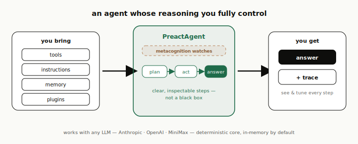
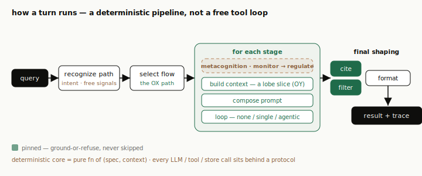
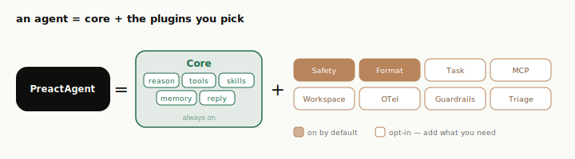

# agent-sdk-go — PreAct

> **A pre-structured, fully inspectable agent-reasoning engine — for developers who want to own every building block of an AI agent, not hand the turn to a model and hope.**

[](./LICENSE)
[](https://go.dev/)
[](./PARITY.md)
[](#status)
[](#status)

> ### 🔀 This is a Go port
> **agent-sdk-go** is a package-for-package Go port of the Python
> [**agent-sdk** (PreAct)](https://github.com/nccasia/agent-sdk), built **test-first**. The Python
> project is the **source of truth**; where Go and the reference disagree, the reference wins.
>
> **Port health** (reproduce with the commands in [Develop](#develop)):
>
> | Gate | Result |
> |---|---|
> | API parity (`go run ./cmd/parity`) | ✅ **116 / 116** `agent_sdk.__all__` exports |
> | Tests (`go test ./... -race`) | ✅ **553 tests across 48 packages**, green under `-race` |
> | `gofmt` / `go vet` | ✅ clean |
> | Examples (`go test ./examples/...`) | ✅ green (offline-deterministic) |
> | Benchmark free-gate (`go run ./cmd/bench`) | ✅ green — **12 / 12** benches reproduce their Python verdict |
>
> **Benchmark verdicts** — the deterministic floor (no provider); live benches report `UNMEASURED`
> offline and pass against a real provider (verified, e.g. `extensionbench --live` → READY 10/10):
>
> | READY (free) | NOT_READY (by design) | UNMEASURED (live, needs provider) |
> |---|---|---|
> | statelessbench · flowbench · promptbench · toolbench · corgictionbech | attentionbench¹ | agentbench · taskbench · extensionbench · skillbench · coding-agent-bench · delegationbench |
>
> ¹ attentionbench is `NOT_READY` in the Python reference too — its qna/research grounding needs a
> `cite` lobe that doesn't fire without RAG. The Go free-gate matches each bench to its Python verdict.

<p align="center">
  
</p>

**agent-sdk-go** is a Go SDK for building AI agents whose **reasoning process you fully control** —
the context, the prompt, the steps, the control flow, the durable state. Rather than free-acting
turn by turn (vanilla ReAct, where the prompt accumulates toward its limit), an agent reasons
through a deliberate pipeline you assemble, inspect, and tune: **lobes** (what context fires) →
**stages** (the reasoning steps) → **flows** (the path), with **metacognition** supervising.

The deterministic core — intent recognition, activation, attention/budget, flow resolution — is a
pure function of `(spec, context)`. Everything that touches the outside world (LLM, tools,
embeddings, stores, queues) sits behind a narrow interface with an in-memory default.

## Why agent-sdk-go

For developers who want durable reasoning and fully customized behavior — controlled from the
reasoning process itself, not a prompt-and-pray wrapper.

- **Pre-structured** — every turn runs a deliberate pipeline you read, reorder, and tune.
- **Multi-stage** — a flow is an ordered sequence of stages, each with its own prompt, context, loop mode, tools, and model.
- **Context that funnels, not floods** — the prompt is re-tiered every hop toward *useful reasoning per token*.
- **Fully inspectable** — each turn emits a structured trace (path, prompts, activations, tools, cost) → HTML viewer.
- **Opt-in plugins** — package a whole capability (lobes/stages/flows/tools) as one plugin; the core ships domain-free.
- **Durable, long-rail tasks** — a scoped `memory` tool and a task mode that persists state across runs.
- **Provider-agnostic** — Anthropic, OpenAI-compatible, MiniMax, and a deterministic fake behind one interface.
- **Benchmarkable** — ground-truth benches grade real behavior against verifiable outcomes, not stubs.
- **Pure Go** — one third-party dependency (`modernc.org/sqlite`, no CGO); everything else is the standard library.

## Install

```bash
go get github.com/nccasia/agent-sdk-go
```

Requires Go 1.21+ (developed on 1.26). No C toolchain needed — the SQLite store uses the pure-Go
`modernc.org/sqlite` driver. From source: `git clone https://github.com/nccasia/agent-sdk-go && cd agent-sdk-go && go test ./...`.

## Quickstart

```go
import (
	"context"
	"fmt"

	"github.com/nccasia/agent-sdk-go/agent_sdk/agent"
	"github.com/nccasia/agent-sdk-go/agent_sdk/clients"
	"github.com/nccasia/agent-sdk-go/agent_sdk/tools"
)

search := tools.Tool("search",
	func(_ context.Context, in map[string]any) (any, error) {
		return "v2 added streaming.", nil
	},
	tools.Desc("Search the knowledge base."),   // description; params declared below
	tools.Param("query", "string", true, nil),
)

a := agent.MustPreactAgent(agent.Config{
	Client:       clients.NewAnthropicClient("claude-opus-4-8"),
	Instructions: "You are a helpful research assistant.",
	Tools:        []any{search},
	// lobes / stages / flows default to the built-in PreAct network when omitted
})

res, _ := a.Query(context.Background(), "What changed in v2?")     // one-shot → *AgentResult
for ev := range a.Act(context.Background(), "What changed in v2?").Iter() {
	fmt.Printf("%T\n", ev)                                        // streaming → typed events
}
```

For tests/dev, swap in the deterministic `FakeClient` (no network):

```go
a := agent.MustPreactAgent(agent.Config{
	Client:       clients.NewFakeClient([]any{"v2 added streaming."}, nil),
	Instructions: "…",
})
```

The full quickstart, runnable offline, is [`examples/quickstart`](./examples/quickstart). For a
real-world reference, see [`examples/codingagent`](./examples/codingagent) — a multi-stage coding
agent (triage → explore → plan → implement → verify) that edits a real filesystem — and
[`examples/subagents-analytics`](./examples/subagents-analytics) — a plan → fan-out → fan-in agent
running real SQL over an in-memory SQLite fixture. Both run offline-deterministic.

## The model

<p align="center">
  
</p>

PreAct splits a turn into two separate, tunable axes — **what the agent thinks about** and **how it
progresses** — with **metacognition** supervising both:

- **`lobes` — the context axis (OY).** Small thinking units that fire the right context + local behavior for one slice of the turn.
- **`stages` / `flows` — the time axis (OX).** A flow is an ordered pipeline; each stage owns its lobe slice, loop mode, and tools. *New capability is a registry row, not an interpreter branch.*
- **`intent` — the router.** Each turn an intent biases the lobes and selects the flow — recognized however you choose: fast deterministic signals or an **LLM classifier**.
- **`metacognition` — always on.** `monitor → regulate`: adjust the lobe slice, retry, or skip a step — but never a pinned output-contract step (`filter` safety, default-on; `cite` grounding, when the opt-in RagPlugin is on).
- **context that funnels.** Re-tiered every hop (inject · hint + fetch · offload) for *useful reasoning per token*, not maximum context.

So a turn is a readable pipeline — recognize the intent, run the flow's stages, shape the reply:

<p align="center">
  
</p>

Deeper dives (the model is identical to the Python reference):
[the OX/OY plane](https://github.com/nccasia/agent-sdk/blob/main/docs/concepts/01-architecture.md) ·
[intent &amp; paths](https://github.com/nccasia/agent-sdk/blob/main/docs/concepts/02-intent-and-paths.md) ·
[context management](https://github.com/nccasia/agent-sdk/blob/main/docs/concepts/04-react-context-management.md) ·
[memory](https://github.com/nccasia/agent-sdk/blob/main/docs/concepts/06-universal-memory.md) ·
[reply flow](https://github.com/nccasia/agent-sdk/blob/main/docs/concepts/03-reply-flow.md).

## Core vs. extensions

The SDK draws a deliberate line between what *every* agent is (the domain-free **core** in
`agent_sdk/lobes`, not toggleable) and what you *add* to it (folder-per-plugin **extensions** in
`agent_sdk/plugins`).

<p align="center">
  
</p>

A plugin contributes the **full capacity surface** — lobes, stages, paths/flows, skills, and tools.
Manage them with a `PluginRegistry` (register / override / enable / disable); an agent with no extra
plugins is identical to the default network.

### Built-in plugins

All live under `agent_sdk/plugins`, one package each:

| Plugin | Capability | Default |
|---|---|---|
| `SafetyPlugin` | output-safety `filter` lobe — every agent wants it | **on** (toggleable) |
| `FormatPlugin` | answer styling — channel / language / tone | **on** (toggleable) |
| `RagPlugin` | retrieval grounding — `cite` + the citation contract (extract / backfill / strip / ground-or-refuse) | opt-in (auto-enabled by `RequireCitations`) |
| `TaskPlugin` | todo-driven task execution (long-running work) | opt-in |
| `MetacognitionPlugin` | think-about-thinking — `monitor → regulate` + the `meta_control` tool | opt-in |
| `PluginSupportTriage` | a worked full-surface example plugin | opt-in (example) |

`safety ≠ rag`: a non-retrieval agent keeps `filter` (safety) but has **no** `cite`/citation logic.
MCP servers are supported via the `agent_sdk/mcp` package and `Config.MCPServers` (discovered at turn
start, then registered like any tool).

```go
import "github.com/nccasia/agent-sdk-go/agent_sdk/plugins"

reg := plugins.BuiltinRegistry()        // no-config builtins
reg.Register(plugins.NewTaskPlugin())   // add an extension
reg.Disable("format")                   // turn one off
a := agent.MustPreactAgent(agent.Config{Client: client, Plugins: reg})
```

## Status

**Beta.** The full public API — the `PreactAgent` façade, the generic `Engine` kernel, first-class
`Stage`, `tools.Tool`, multi-provider clients, Session/Memory stores, the plugin/extension system,
stateless serving, the serializable spec, and the probe/inspect/bench surface — is implemented at
**100% API parity (116/116 exports)** with the Python reference and covered by the test suite
(**553 tests across 48 packages**, green under `-race`). The API may still shift before 1.0; changes
are tracked in [`CHANGELOG.md`](./CHANGELOG.md).

## Inspection

Every turn is fully inspectable. `probe.Probe` runs one real turn and captures the full trace; the
`report`/`viewer` packages render a single-file HTML (path · flow · per-stage system prompt &
provenance · tools · cost). The benchmark runner emits an inspectable report per bench **by default**:

```bash
go run ./cmd/bench          # free-gate + writes benchmarks/results/<bench>.html + index.html
go run ./cmd/bench -no-html # gate only
```

## Single-dependency invariant

`agent-sdk-go` imports only the Go standard library, other `agent_sdk` packages, and exactly one
third-party module — `modernc.org/sqlite` (pure-Go, no CGO). No CGO, no host application package, so
the SDK stays standalone and publishable. (The Python reference enforces the equivalent "leaf"
invariant via `tests/test_sdk_isolation.py`.)

## Develop

```bash
go build ./...
gofmt -l .              # must print nothing
go vet ./...            # clean
go test ./... -race     # 553 tests, green
go run ./cmd/parity     # 116/116 exports (100%)
go run ./cmd/bench      # free-gate green / exit 0
go test ./examples/...  # examples green
```

Benchmarks: the free benches are deterministic and gated by `cmd/bench`; the live benches require a
provider (set credentials, then run with a model — they report `UNMEASURED` without one). Every bench
also emits an inspectable HTML report under `benchmarks/results/`.

## How the port is driven

Built test-first as a deterministic rung-by-rung port over a dependency-ordered ladder (`tasks/`):
each `tasks/NN-*/TASK.md` translates the named Python tests to Go (red), implements that rung's
package(s) to green, checks off `PARITY.md`, and commits — only when every check exits 0. The
drivers live in `.claude/workflows/`. See [`docs/porting.md`](./docs/porting.md) and
[`PARITY.md`](./PARITY.md) (the `__all__` ledger).

## Documentation

- [`docs/api.md`](./docs/api.md) — the Go public surface, package by package
- [`docs/porting.md`](./docs/porting.md) — how the port maps to the Python reference
- [`PARITY.md`](./PARITY.md) — the `agent_sdk.__all__` → Go export ledger
- The conceptual model (identical to Python): [`agent-sdk/docs/concepts`](https://github.com/nccasia/agent-sdk/tree/main/docs/concepts)

## Contributing

Contributions are welcome — see [`CONTRIBUTING.md`](./CONTRIBUTING.md) for the dev setup, the
invariants every change must keep (deterministic core, default-network parity, API parity,
citations-mandatory), and the test/lint gates.

## License

Licensed under the [Apache License 2.0](./LICENSE). See [`NOTICE`](./NOTICE) for attribution.
